Приветствую тебя читатель. Совсем недавно участвовал на **UralCTF** и наткнулся на достаточно интересную таску в моей любимой категории reverse. Вот она:

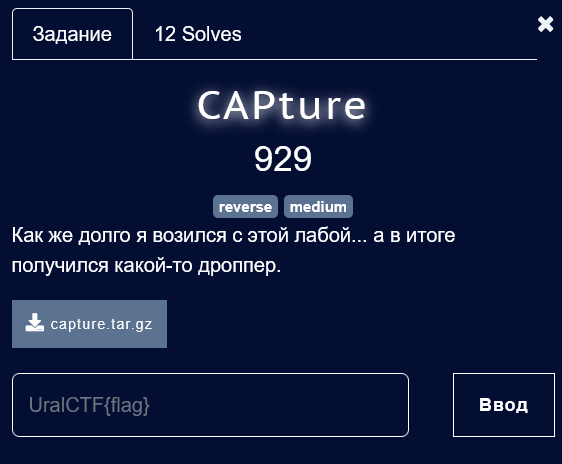

В предоставленном архиве нас ожидает PE файл capture.exe. Давай запустим его:

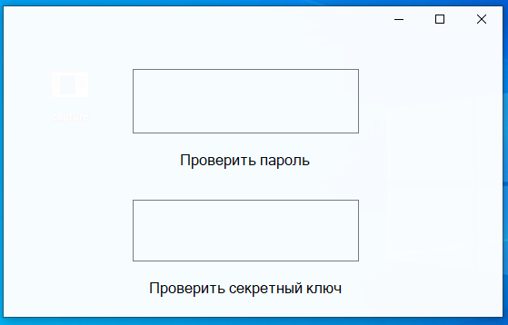

Нас встречает проверка пароля и какого то секретного ключа. Не густо.

Первое что я делаю, когда встречаю неизвестный мне файл, чтобы чуть лучше понять что он из себя представляет - отправляю его в **Detect It Easy**.

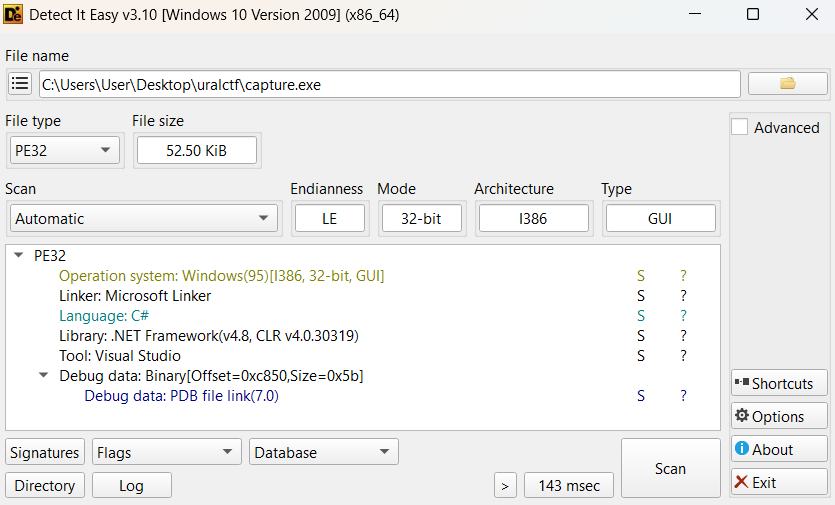

Отлично. Теперь мы знаем, что программа была написана на C#(C# компилируется в промежуточный язык (Intermediate Language, IL), который затем выполняется на платформе .NET. Этот IL сохраняет много информации о структуре программы, что облегчает декомпиляцию.). Для того чтобы получить декомпил C# существует куча инструментов:
**ILSpy**, **dotPeek**, **Reflector**, **JustDecompile** и **dnSpy**. На своём небольшом пути реверсера мне  доводилось пользоваться **dnSpy**. 
На мой взгляд он достаточно популярен и очень удобен, поэтому им я воспользуюсь и сейчас:

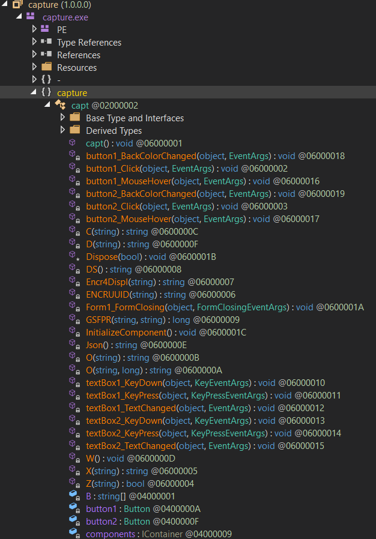

Посмотрим на метод `button1_Click`:

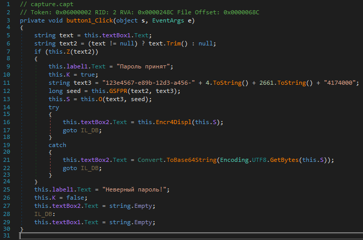

Это обработчик нажатия кнопки. Записанный нами пароль передаётся некоему методу `Z()`, который в свою очередь выдаёт вердикт о правильности пароля, а затем происходят какие то действия с формированием сида. Сложно как то... Посмотрим на метод `button2_Click`, который судя по названию является обработчиком нажатия на вторую кнопку:

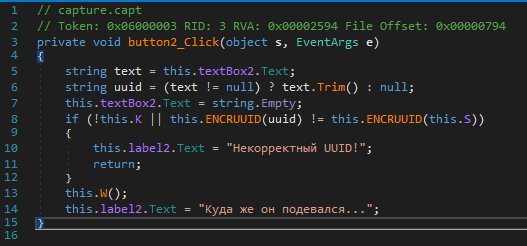

Хммм... Вот это выглядит уже куда легче. Здесь мы видим проверку введённого UUID. Если он не правильный, то происходит возрат из метода. Если же проверка проходит, то вызывается метод `W()` и выводится текст `Куда же он подевался...`. Выглядит как то, что можно попробовать запатчить. Но для начала посмотрим на метод `W()`:

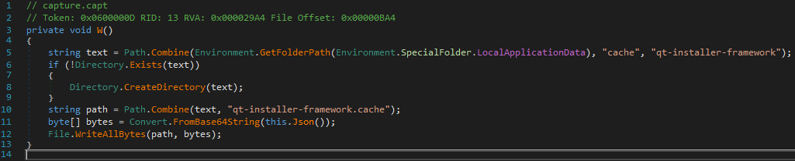

Теперь становится понятно, почему автор в описании таски упомянул дроппер. Здесь создаётся файл `qt-installer-framework.cache`, по такому пути: 
`%AppData%\Local\cache\qt-installer-framework\`
На моей виртуальной машине он будет выглядеть так:
`C:\Users\user\AppData\Local\cache\qt-installer-framework`
Затем мы видим декодирование данных полученных с `Json()`. Посмотрим что внутри загадочного метода `Json()`:

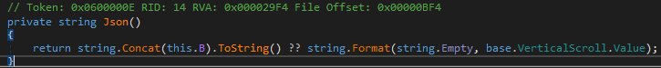

Мы видим, что метод `Json()` возвращает строку, которая формируется из `this.B` с помощью `string.Concat(this.B)`. Посмотрим что из себя представляет это поле `B`:

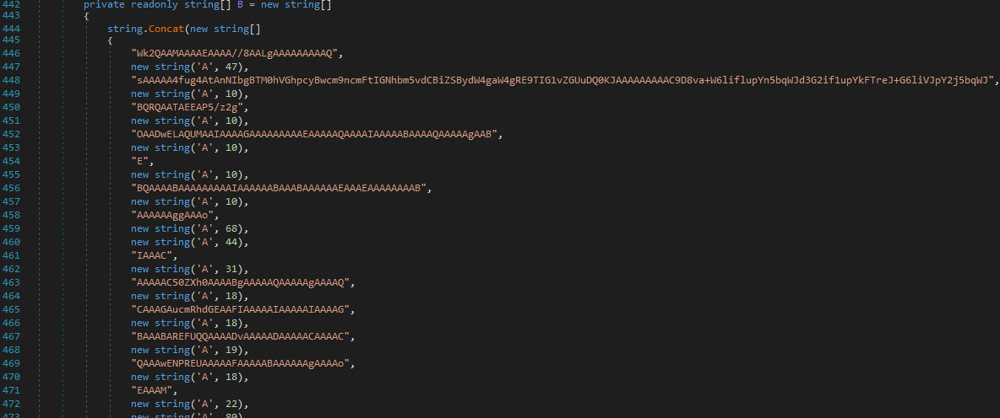

Судя по всему это байты PE файла, закодированные в base64. Программа в случае, если мы вводим верные данные, сбрасывает PE файл по пути `C:\Users\user\AppData\Local\cache\qt-installer-framework\qt-installer-framework.cache`.
Теперь попробуем запатчить. Сделать мы это можем непосредственно в **dnSpy**. Просто уберем код с проверкой в обработчике 2 кнопки:

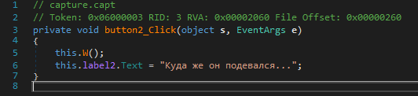

Запустим программу и убедимся, что патч работает:

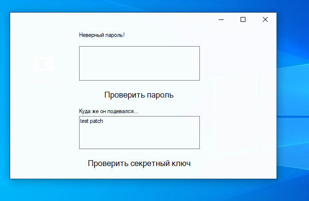

Отлично. Перейдём по пути и убедимся, что файл сбросился:

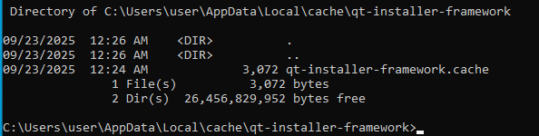

Посмотрим, что из себя представляет сброшенный файл поближе. Для этого можно воспользоваться **IDA/Ghidra/Binja** etc... Я предпочитаю золотую классику **IDA**:

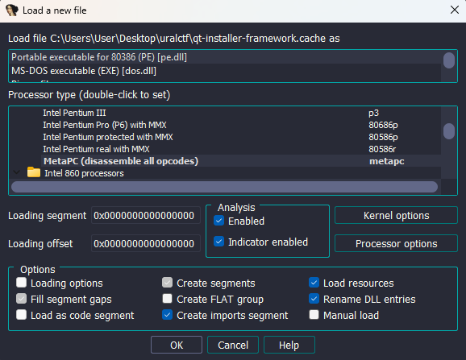

как я и предпологал, определила, что мы имеем дело с PE файлом. Перейдём на функцию `start`:

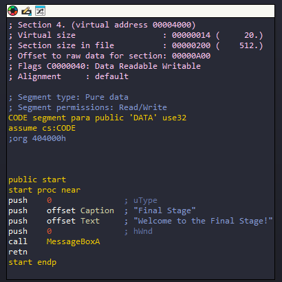

Мы можем увидеть строки "Final Stage", "Welcome to the Final Stage!" и... НИЧЕГО! Реально ничего. Файл даже не запускается... Но мы не сдаёмся, мы сделаны из стали. Попробуем открыть дропнутый файл в hex-редакторе. Я предпочитаю ныне популярный **ImHex**. Немного покрутив ползунок, я наткнулся на такие байты:

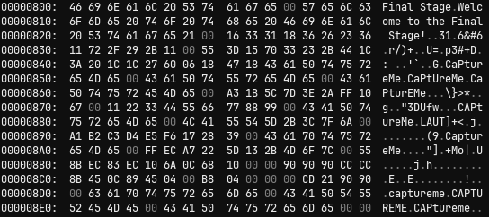

После нескольких попыток применить различные алгоритмы дешифровки, я обратил внимание на название таски - "CAPture". 

Попробовав использовать строки, связанные с именем таски, в качестве ключа для XOR-шифрования, я обнаружил, что ключ "CAPtureMe" успешно расшифровывает данные в читаемый текст, содержащий флаг. Вот сами байты с флагом:

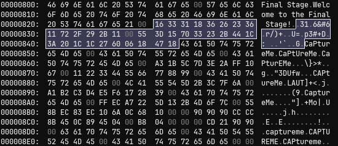

А вот скрипт для дешифровки:

```python
encrypted_data = bytes([
    0x16, 0x33, 0x31, 0x18, 0x36, 0x26, 0x23, 0x36, 0x11, 0x72, 0x2F, 0x29, 0x2B, 0x11, 0x00,
    0x55, 0x3D, 0x15, 0x70, 0x33, 0x23, 0x2B, 0x44, 0x1C, 0x3A, 0x20, 0x1C, 0x1C, 0x27, 0x60,
    0x06, 0x18, 0x47, 0x18
])

key = b"CAPtureMe"

decrypted = []
for i in range(len(encrypted_data)):
    decrypted_byte = encrypted_data[i] ^ key[i % len(key)]
    decrypted.append(decrypted_byte)

flag = bytes(decrypted).decode('utf-8', errors='ignore')
print(flag)
